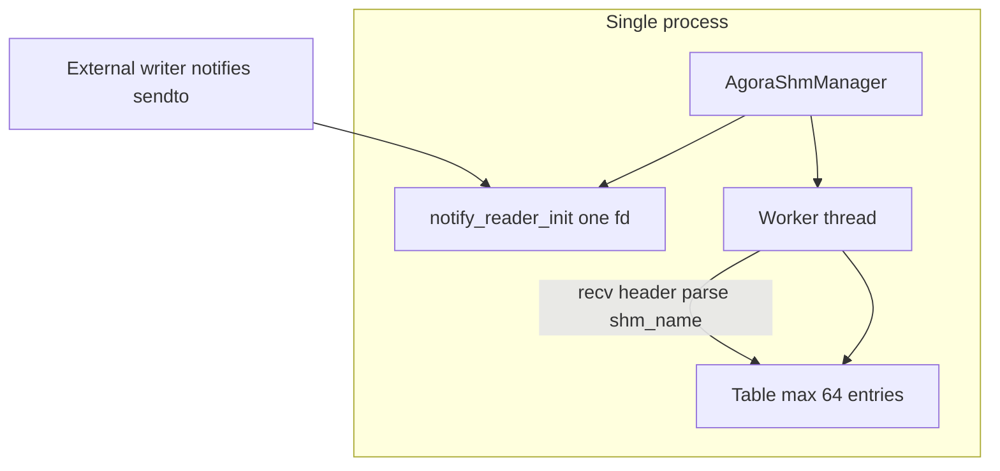

# agora_shm_manager 规划（上层管理）

## 目标

在 **[`src/agora_shm_ipc.h`](src/agora_shm_ipc.h) / [`src/agora_shm_ipc.c`](src/agora_shm_ipc.c)** 之上增加 **manager** 层：单进程 **一个 manager、一个读端 notify、N 个写 IPC、M 个读 IPC**；以 **`shm_name` 字符串** 作为表内唯一键，负责多路 SHM 的登记、监听通知、按需 `open` 读端并 `read`、以及生命周期收尾。

对外命名统一为 **`agora_shm_manager_xx`**（类型如 `AgoraShmManager`，函数如 `agora_shm_manager_start`）。

## 已确认决策（与评审问答一致）

**问卷对应：1A / 2A / 3A / 4C / 5A。**

1. **帧交付**：采用 **注册回调**。工作线程在 `agora_shm_ipc_read` 成功后调用业务注册的 `on_frame`（签名在下方 API 草拟中约定）；**回调内不得再调用会阻塞或长时间持 manager 锁的 API**（实现上应在 **释放表锁之后** 再调回调，避免死锁）。
2. **写端 notify**：**由业务进程创建并持有** `AgoraShmIpcNotify`（`agora_shm_ipc_notify_writer_init`）；manager **只**创建并持有 **读端** `notify_reader_init`。业务须保证所有写端的 **`reader_recv_path` 与 manager 绑定的路径一致**，否则 manager 收不到 `sendto`。
3. **表结构**：**固定最多 64 槽位** 的数组 + **线性查找** `shm_name`（实现简单；满表时 `add` / 自动建读失败返回 `ENOMEM` 或约定错误码）。
4. **`open(attach)` 遇 `ENOENT`**：**不重试**，**丢弃该次通知**；依赖后续写端再次 `write`+`notify` 或业务先 **`agora_shm_manager_add` 写端** / 先创建 SHM 后再通知。
5. **表项移除**：**仅**通过 **`agora_shm_manager_remove(shm_name)`** 显式移除并 `agora_shm_ipc_close`；不做 TTL 自动淘汰（若将来需要，另开扩展章节）。

## 与下层的关系

- 下层协议不变：seqlock、整头 `sendto` 唤醒、[`AgoraShmIpcHeader`](src/agora_shm_ipc.h) 中含 `shm_name`、`payload_size` 等（见 [`PLAN_shm_ipc.md`](PLAN_shm_ipc.md)）。
- manager **不修改** seqlock 语义，只 **编排** 多个 `AgoraShmIpc` 与 **一个** 读端 notify fd。



## 生命周期

### `agora_shm_manager_start`

- 入参建议包含：`reader_recv_path`（与所有写端 notify 的 peer 路径一致）、**`on_frame` 回调** + **`user` 指针**、可选 **默认 `payload_size` 上限**（若通知头与表项冲突时的策略见下节）。
- 初始化 **64 槽** 表（全空）、互斥锁、线程停止标志（`atomic` 或 `volatile` + `pthread_join`）。
- 调用 **`agora_shm_ipc_notify_reader_init`** 绑定 `reader_recv_path`。
- 启动 **一个** 工作线程：对 notify fd **`poll` / `recv`**，`recv` 缓冲 **`alignas(AgoraShmIpcHeader) unsigned char buf[sizeof(AgoraShmIpcHeader)]`**；将 `buf` **转换为** `const AgoraShmIpcHeader *` 解析 `shm_name`、`payload_size`、`magic`/`version`（非法则丢弃）。
- **表中无此 `shm_name`**：调用 **`agora_shm_ipc_open(shm_name, payload_size, 0, &ctx)`**。若返回 **`ENOENT`**：**直接丢弃本包，不重试**。若成功：插入表（标记为读侧自动创建或 `role=read`）。
- **表中已有**：取出对应 `AgoraShmIpc *`，调用 **`agora_shm_ipc_read`**；成功则 **释锁后** 调 **`on_frame(shm_name, payload, len, meta, user)`**。
- 写侧表项：一般由 **`agora_shm_manager_add`** 预先登记（见下）；线程路径主要处理 **读** 与 **动态发现读**。

### `agora_shm_manager_close`

- 置停止标志；**join** 工作线程。
- 遍历表：对每个非空项 **`agora_shm_ipc_close`**。
- **`agora_shm_ipc_notify_fini`** 读端 notify。
- 清空状态（或要求调用方不再使用 `AgoraShmManager` 指针）。

## `agora_shm_manager_add` / `agora_shm_manager_remove`

- **`add`**：入参包含 **`shm_name`**、**角色**（读 / 写，可用 `enum`）、已 **`agora_shm_ipc_open` 成功** 的 `AgoraShmIpc`（或由 PLAN 约定 manager 内代为 `open`，首版可要求调用方已 open 以减少职责）；在表中找空槽或同键更新策略（**同键已存在则返回 `EEXIST` 或先 remove 再 add** 需在实现中写死一种）。
- **`remove`**：按 `shm_name` 查找，**`agora_shm_ipc_close`** 并从表删除；与线程 **共用互斥锁**。

## 回调类型（草拟）

```c
typedef void (*agora_shm_manager_on_frame_fn)(
    const char *shm_name,
    const void *payload,
    size_t len,
    const AgoraShmIpcFrameMeta *meta,
    void *user);
```

- `payload` / `meta` 生命周期：实现可提供 **线程局部缓冲** 或 **在回调返回前有效**（PLAN 推荐 **回调返回即失效**，业务若需异步应自行拷贝）。

## 并发与锁

- **一张互斥锁**保护：64 槽表、`stop` 标志相关的状态迁移。
- **禁止**在持锁时调用用户回调；**禁止**在回调里调用 `manager_remove` 同线程可重入导致死锁的路径——若必须支持，实现可用 **“待删除队列”** 在锁外处理（首版可在 PLAN 中标为 TODO）。

## 边界与错误策略

- **`payload_size` 与已打开表项不一致**：首版策略建议 **拒绝更新并打日志** 或 **close 再按通知重开**（二选一写进实现注释）。
- **表满（64）**：`add` 或自动插入读失败，返回明确错误。
- **通知长度不足 `sizeof(AgoraShmIpcHeader)`**：丢弃。

## 源码与构建（已实现首版）

| 路径 | 说明 |
|------|------|
| [`src/agora_shm_manager.h`](src/agora_shm_manager.h) | `AgoraShmManager`、`agora_shm_manager_start` / `_close` / `_add` / `_remove`、回调类型 |
| [`src/agora_shm_manager.c`](src/agora_shm_manager.c) | 64 槽表、线程主循环、`pthread` |
| [`Makefile`](Makefile) | `build/agora_shm_manager.o` 纳入 `make all`；链接增加 `-pthread` |

业务可：`cc ... build/agora_shm_ipc.o build/agora_shm_manager.o -pthread`（Linux 另加 `-lrt`）。

## 示例 `agora_manager_demo`（用法与设计约定）

源码：[examples/agora_manager_demo.c](examples/agora_manager_demo.c)，`make all` 生成 `build/agora_manager_demo`。

**命令行（三参数）：**

```text
./build/agora_manager_demo <notify_write_bind> <notify_peer_recv> <write_shm_name>
```

- **`notify_write_bind`**：本进程 **`agora_shm_ipc_notify_writer_init` 的 bind 路径**（写端本地 Unix 路径）。
- **`notify_peer_recv`**：每次 **`agora_shm_ipc_write` 后 `sendto` 的目标路径**，必须为 **对端进程 manager 的 `notify_reader_init` 绑定路径**。
- **`write_shm_name`**：本进程 **`agora_shm_ipc_open` + `write` 使用的 POSIX SHM 名**。

**约定（demo 内实现，便于双进程对称配置）：**

- 本进程 **manager** 的接收路径 **不是** 命令行第 4 个参数，而是由 **`notify_write_bind` 追加后缀 `".recv"`** 得到（长度须小于 `sockaddr_un.sun_path`）。因此双进程时：**进程 B 的 `notify_peer_recv` = 进程 A 的 `notify_write_bind` + `".recv"`**，反之亦然。

**双进程对称示例：**

- 进程 A：`./build/agora_manager_demo /tmp/am_a /tmp/am_b.recv /agsh_a`
- 进程 B：`./build/agora_manager_demo /tmp/am_b /tmp/am_a.recv /agsh_b`

各自创建/附着自己的 `write_shm_name`；**无需** `agora_shm_manager_add` 对端 SHM 即可工作：工作线程收到通知后按头内 **`shm_name` / `payload_size`** **自动 `open` 读附着** 对端段（`ENOENT` 则丢包，见上节）。demo 内 **`payload_size` 固定 4096**。

## 实施顺序

1. 定稿本 PLAN（本文件）。
2. 实现 `start` / `close` / 监听线程 / 回调 + **ENOENT 即丢包**。
3. 实现 `add` / `remove` 与读写角色字段。
4. **示例**：见上节「示例 `agora_manager_demo`」；与底层 `agora_writer_demo` / `agora_reader_demo` 可独立联调。
