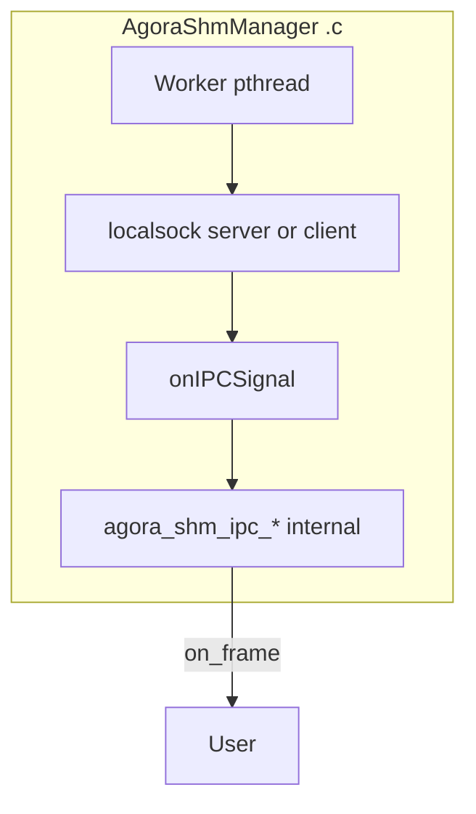

# agora_shm_manager 规划（组合层：SHM IPC + localsocket）

本文档为 **重设计** 版本，取代原先「Unix notify + manager 表」为主线的描述。实现语言：**纯 C**（C11）。**与旧版实现不并存**：落地时以本 PLAN 为准 **替换** [`agora_shm_manager.h`](src/agora_shm_manager.h) / [`agora_shm_manager.c`](src/agora_shm_manager.c) 与 **`agora_manager_demo`** 等依赖路径，不再保留「Unix notify + 三参数 demo」并存形态。

## 一、总体规范

1. **组合层**：`agora_shm_manager` 是对 **[`agora_shm_ipc`](src/agora_shm_ipc.h)**（POSIX SHM + seqlock）与 **[`agora_localsock`](src/agora_localsock.h)**（127.0.0.1 UDP）的 **组合编排层**，对外暴露 **`AgoraShmManager`** 与 `agora_shm_manager_*` API。
2. **信令与唤醒**：manager 仅通过 **localsocket**（见 [`PLAN_localsocket.md`](PLAN_localsocket.md)）；仓库已移除 **`agora_shm_ipc_notify`** 模块。
3. **类型隐藏（定稿修订）**：公开头文件中 **不出现** `AgoraShmIpc`、`AgoraShmIpcNotify` 指针及 **`agora_localsock_*` 符号**。**`on_frame` 使用 [`AgoraShmIpcHeader`](src/agora_shm_ipc.h)** 快照（与 `agora_shm_ipc_read` 的 `out_hdr` 一致；manager.h **`#include "agora_shm_ipc.h"`** 用于 `AgoraShmIpcHeader`、`AgoraShmIpcFrameMeta` 及必要常量；**不得**在公开 API 中暴露 `AgoraShmIpc *` 等句柄）。`AgoraShmIpc` / `agora_localsock_*` **仅**出现在 **manager.c** 内部。
4. **纯 C**：`pthread`；**`bool`** 使用 `<stdbool.h>`。

## 二、对外 API（目标签名）

```c
#include <stdbool.h>
#include <stddef.h>
#include <stdint.h>

#include "agora_shm_ipc.h"   /* AgoraShmIpcHeader in on_frame; FrameMeta for add/write */

typedef struct AgoraShmManager AgoraShmManager;

typedef void (*agora_shm_manager_on_frame_fn)(
    const char *shm_name,
    const void *payload,
    size_t len,
    const AgoraShmIpcHeader *hdr,
    void *user);

/**
 * port: UDP 端口（127.0.0.1），必须 > 0；port==0 非法，返回 -1 且 errno=EINVAL。
 * server_mode: true=localsocket server bind port；false=client connect 127.0.0.1:port。
 * localsock_max_clients: 仅 server 模式传入 `agora_localsock_server_create` 的 max_clients；client 模式可忽略（实现传占位或忽略）。
 * localsock_keepalive_ms: 传入 server 的 keepalive_interval_ms（5× 超时）；与 client 侧线程内 500ms keepalive **独立**（见 3.2）。
 * max_read_cap: 工作线程读 SHM scratch 上限（0=实现内默认）。
 */
int agora_shm_manager_start(agora_shm_manager_on_frame_fn on_frame,
                            uint16_t port,
                            bool server_mode,
                            size_t localsock_max_clients,
                            uint32_t localsock_keepalive_ms,
                            void *user,
                            size_t max_read_cap,
                            AgoraShmManager **out);

void agora_shm_manager_close(AgoraShmManager *m);

/** 写表登记：`agora_shm_ipc_open(..., is_creator=1)` + `writer_session_begin`。
 *  max_payload_size 即 IPC payload_size，须非零（EINVAL）。写表/读表各最多 64 条；
 *  若 shm_name 已在写表或读（自动附着）表：EEXIST。表满：ENOMEM。 */
int agora_shm_manager_add(AgoraShmManager *m, const char *shm_name,
                          size_t max_payload_size);

/** 先写表按名移除并 close；否则读表；皆无则 ENOENT。 */
int agora_shm_manager_remove(AgoraShmManager *m, const char *shm_name);

/** 写表项上 `agora_shm_ipc_write`，再发 localsock WRITECMD（头 + `AgoraShmIpcFrameMeta`）。 */
int agora_shm_manager_write(AgoraShmManager *m, const char *shm_name,
                            const void *data, size_t len,
                            const AgoraShmIpcFrameMeta *meta);
```

### 回调与 `hdr` 生命周期（定稿）

- **`hdr` 指针**指向与当前帧一致的 **`AgoraShmIpcHeader`** 快照（栈上或实现内缓冲）；**仅在 `on_frame` 回调返回前有效**，返回后不得再使用，**业务不得持有裸指针跨异步**。

## 三、实现逻辑

### 3.1 `port` 与校验

- **`port == 0` 或 `port` 表示非法 UDP 端口**：**`agora_shm_manager_start` 失败**，`errno = EINVAL`。
- **`server_mode == true`**：`agora_localsock_server_create(port, localsock_keepalive_ms, localsock_max_clients, ...)`。
- **`server_mode == false`**：`agora_localsock_client_create(port, ...)`（connect 到 `port`）。

### 3.2 工作线程与 client keep-alive（定稿）

- **一条** worker `pthread`。
- **Server 模式**：循环调用 **`agora_localsock_server_poll`**（带超时），收到数据后进入 **`onIPCSignal`** 链路（见 3.4）。
- **Client 模式**：循环 **`agora_localsock_client_poll`**（见 [`PLAN_localsocket.md`](PLAN_localsocket.md) 新增 API）+ 定时逻辑：除 poll 外，**每 500ms** 调用一次 **`agora_localsock_client_send_keepalive`**（由 manager 线程承担，**不**要求业务再驱动；与「独立使用 localsock 客户端时由业务发 keepalive」可并存——见 localsock PLAN 备注）。
- **`localsock_keepalive_ms`**：仅用于 **server** 侧 peer 超时（`5×`）；**不**作为上述 500ms 的来源。

### 3.3 `onIPCSignal`（实现内 static，不进头文件）

- 收到一帧 **localsocket UDP 负载** 后调用 `onIPCSignal(recv_buffer, recv_len)`。
- **首版**：可仍为 **空实现**；后续解析 **`agora_localsock_header` + `msg_type==APP` 的 payload**（见 3.5），再驱动内部 SHM 与 `on_frame`。

### 3.4 与 SHM IPC（规划）

- 实现文件内 `#include` `agora_shm_ipc.h` / `agora_localsock.h`；**`on_frame` 在成功 `agora_shm_ipc_read` 后、释锁后调用**。

### 3.5 APP 报文 payload 格式（定稿）

- **`msg_type == AGORA_LOCALSOCK_MSG_APP`（2）** 时，**payload 主体**为 **`AgoraShmIpcHeader` 的整头裸字节**，长度为 **`sizeof(AgoraShmIpcHeader)`**，便于从中读取 `shm_name`、`payload_size`、`magic`/`version` 等并 **`agora_shm_ipc_open` / `agora_shm_ipc_read`**。
- UDP 报文布局：**12 字节 `agora_localsock_header`** + **`payload_len` 字节**，其中上述情况 **`payload_len == sizeof(AgoraShmIpcHeader)`** 且内容为一帧头镜像。

### 3.6 `agora_shm_manager_add` / `agora_shm_manager_remove`

- **读表 / 写表**：内部 **`read_entries`**（UDP 自动附着读，最多 64）与 **`write_entries`**（`add` 登记的写端创建，最多 64）分离；**`close`** 时两套表项均 **`agora_shm_ipc_close`**。
- **`add`**：`agora_shm_ipc_open(shm_name, max_payload_size, is_creator=1)` + **`agora_shm_ipc_writer_session_begin`**；`max_payload_size == 0` → `EINVAL`；写表或读表已存在同名 → **`EEXIST`**；写表满 → **`ENOMEM`**；其它失败透传 **`errno`**。
- **`remove`**：先查写表移除并 close；否则查读表；两处都无 → **`ENOENT`**。
- **UDP 派发**：若 `shm_name` 已在写表登记，**不再**为该名自动打开读附着（避免同 manager 内读写双持同一名的歧义）。

### 3.7 WRITECMD 与 `agora_shm_manager_write`

- **`msg_type == AGORA_LOCALSOCK_MSG_WRITECMD`（3）**：UDP 负载为 **`sizeof(AgoraShmIpcFrameMeta)`** 的裸 meta；接收侧若读表尚无该 `shm_name`，则 **`shm_open` + `mmap` 头** 探测 **`payload_size`** 后再 **`agora_shm_ipc_open` 附着读** 并 **`agora_shm_ipc_read` / `on_frame`**（与 APP 头镜像路径等价信息）。
- **`agora_shm_manager_write`**：仅在**写表**命中 `shm_name` 时 **`agora_shm_ipc_write`**；随后 **server** 调用 **`agora_localsock_server_send_datagram`** 向已登记 peer **广播** WRITECMD；**client** 调用 **`agora_localsock_client_send_datagram`**。无 peer 时 server 侧信令 **返回 0**（写已成功）。**`meta` 不可为 NULL**（`EINVAL`）。

## 四、与旧版差异（摘要）

| 项目 | 旧版 | 新版 |
|------|------|------|
| 信令 | （已移除独立 notify 模块） | localsocket UDP |
| demo | 三参数 Unix 路径 | **仅** port + server_mode + localsock 参数（不并存） |
| `add`/`remove` | 有逻辑 | **读写分表** + `add(max_payload_size)` / `remove` 按名 |

## 五、并发与生命周期

- **`agora_shm_manager_close`**：stop → **join** → 销毁 localsock → 关闭读表与写表全部 SHM 槽位 → `free`。
- **禁止持锁**调用 `on_frame`。

## 六、依赖与构建

- 链接：**`agora_shm_ipc.o`** + **`agora_localsock.o`** + **`pthread`**。

## 七、图示



## 八、实施顺序

1. 在 **`agora_localsock`** 实现 **`agora_localsock_client_poll`**（见 PLAN_localsocket）。
2. 重写 **`agora_shm_manager.h` / `.c`** 与 **`agora_manager_demo`**，删除旧 notify 启动路径，**不并存**。
3. 实现 `start` / `close` / 线程 / 500ms client keepalive / `onIPCSignal` 占位或解析。
4. 后续：`onIPCSignal` 全逻辑、`add`/`remove`、表驱动 `on_frame`。

---

**文档版本**：2026-04-15；合并定稿：**`AgoraShmIpcFrameMeta` 回调**、**`localsock_max_clients` + `localsock_keepalive_ms`**、**`agora_localsock_client_poll`**、**client 线程 500ms keepalive**、**port 非法规则**、**add/remove ENOSYS**、**不并存**、**APP payload = 整头 `AgoraShmIpcHeader`**。
