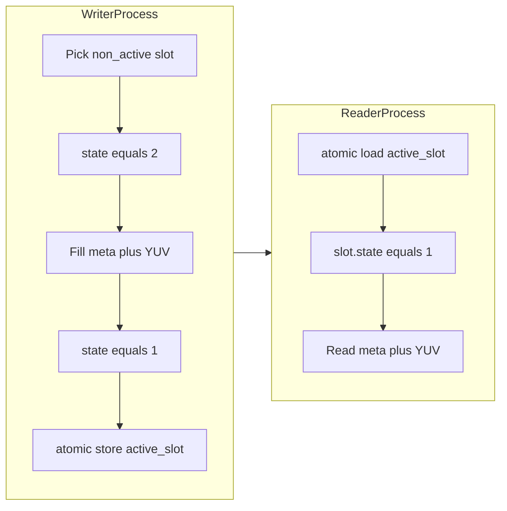

# 双进程 YUV 共享内存（纯 C）设计与文档计划

## 背景与约束对齐

- **数据量**：单帧 `1920 × 1080 × 3/2 = 3,110,400` 字节（按常见 YUV420 平面布局理解；不在协议内编码子采样细节，仅按字节区传递）。
- **速率**：30 fps；同机两进程、**读写侧各自单线程**。
- **语义**：`state`：`0` = 无效/未就绪（初始化、写端重启清理、读端应忽略）；`1` = 一帧写入完成可读；`2` = 写入中。读侧**仅当 `state == 1` 时**才将一帧视为有效；大帧拷贝期间需配合下文「读端再校验」避免与写端重启失效并发时脏读。
- **生命周期**：任一侧崩溃退出后，**POSIX 共享内存对象仍保留**（直至显式 `shm_unlink` 或系统策略回收）；存活侧继续 `mmap` 同名对象即可；重启侧再次 `shm_open` 附着，**不要求**与对端同时存活。
- **启动次序无关**：读先起/写先起均可。约定：**首个**成功 `O_CREAT` 创建并 `ftruncate` 的进程负责将整块 `ShmRegion` **置零**（或等价初始化），保证对端随后 `mmap` 看到的是确定初态；**第二个**进程只打开附着，**不得**整块 `memset`（避免把对端正在写的有效帧抹掉）。写进程在**自身每次启动**（含崩溃后重启、且无论是否创建者）执行写端恢复步骤（见下节），与读进程是否已运行无关。
- **写侧不阻塞**：若采用**单槽 + 等读端释放**，写端在读慢时会被迫等待，与「不阻塞」冲突。推荐 **双槽（ping-pong）+ 发布索引**：写端始终在「非当前发布槽」上 `state=2 → 填数据 → state=1 → 原子更新发布槽号」，`memcpy`/mmap 本身不阻塞；读慢时**丢中间帧**、只保证读到「最近完成的一帧」，符合常见实时预览/采集场景。若你必须「零丢帧」，需在计划中改为环形多槽或显式背压 API（会改变接口），当前按**非阻塞写 + 可能跳帧**实现。

## 共享内存布局（建议固定、可 `static_assert`）

在单独头文件（如 [`shm_yuv_layout.h`](shm_yuv_layout.h)）中用 `_Static_assert` 固定布局，避免编译器随意填充导致两进程不一致：

| 字段 | 类型 | 说明 |
|------|------|------|
| `userid` | `char[64]` | 不足补 `'\0'` |
| `state` | `uint32_t` | `0` 无效；`1` 可读；`2` 写入中 |
| `width` | `uint32_t` | 如 1920 |
| `height` | `uint32_t` | 如 1080 |
| `sequence` | `uint32_t` | 单调递增帧序号，便于读端检测丢帧 |
| `yuv_data` | `uint8_t[YUV_SIZE]` | `YUV_SIZE = 3110400` |

- **双槽**：`struct ShmSlot { ... };`，顶层 `struct ShmRegion { atomic_uint active_slot; ShmSlot slots[2]; }`（或 `uint32_t` + 显式 `atomic_thread_fence`；推荐 C11 `stdatomic.h`）。
- **跨进程可见性**：对 `state` 与「发布槽」的更新使用 **release**，读端使用 **acquire**（或对应原子顺序），避免 CPU 重排序导致读到未完成数据。

## 进程生命周期、崩溃恢复与启动次序

- **写进程崩溃**：常见残留为某一槽长期停在 `state==2`（写一半死掉）。**写进程每次启动**在首次写帧之前：对**两个槽**的 `state` 以 **release** 写为 `0`（无效），再将 `active_slot` **release** 置为 `0`（或约定初值），从而清掉「卡死在中途」的槽，新会话从干净双槽开始；存活读进程在此间隙可能短暂看不到 `state==1`，属预期。
- **读进程崩溃**：共享内存内容与 `active_slot`、各槽 `state` 保持写进程最后发布的状态；读进程重启后照常 `atomic_load(active_slot)` 并仅在 `state==1` 时消费，**无需**向共享区写恢复标记。
- **读端与写端重启的并发（大帧拷贝）**：写端重启可能对槽做 `state=0` 失效，若读端已在拷贝 3MB YUV，理论上存在「先见 `1` 后被失效」的窗口。实现上要求读端采用 **拷贝前/后两次一致性检查**（例如：拷贝前记录 `sequence`（或槽内 `uint64_t stamp`）与 `state`；`memcpy` 后再次 `atomic_load` `state` 与序号，**仅当仍为 `1` 且序号未变**时采纳本帧，否则丢弃并重试）。这样在单方重启下避免把半失效缓冲区当有效帧使用。
- **`ftruncate`/`mmap` 尺寸**：仅**创建者**在首次创建时对对象 `ftruncate(sizeof(ShmRegion))`；附着方打开后应用 `fstat` 或约定常量校验大小，避免二次截断把对端数据截断。

## 实现文件规划（纯 C）

| 文件 | 职责 |
|------|------|
| [`shm_yuv_layout.h`](shm_yuv_layout.h) | 常量、`ShmSlot`/`ShmRegion`、对齐与 `_Static_assert` |
| [`shm_yuv.c`](shm_yuv.c) + [`shm_yuv.h`](shm_yuv.h) | `shm_open`/`ftruncate`/`mmap`/`munmap`/`shm_unlink` 封装；区分「创建并初始化」与「仅附着」；提供写端 `writer_session_begin()`（双槽 `state=0` + 重置 `active_slot`） |
| [`writer_demo.c`](writer_demo.c) | 演示写端：循环写 30fps（可用 `nanosleep` 模拟），`userid` 填 64 字节，更新 `sequence` |
| [`reader_demo.c`](reader_demo.c) | 演示读端：轮询或定时读；`state==1` 时拷贝 YUV，**拷贝后**再校验 `state` 与 `sequence` 与拷贝前一致，否则丢弃重试 |
| [`Makefile`](Makefile) | `-std=c11 -Wall -Wextra`，链接 `-lrt`（Linux）；**macOS 一般无需 `-lrt`**，Makefile 可用 `uname` 区分 |

平台说明：当前环境为 **darwin**，使用 **POSIX 共享内存**（`shm_open` + 唯一名称，如 `/shm_yuv_demo`）；Linux 同样适用。命名需以 `/` 开头且权限合理；提供 `shm_unlink` 清理说明，避免泄漏。

## [`README_shm.md`](README_shm.md) 应写入的「过程记录」目录

1. **需求摘要**：与你列出的 1–7 条对应说明（含双缓冲与不阻塞写的含义）。
2. **二进制布局图**：槽内字段顺序、`YUV_SIZE`、双槽 + `active_slot` 说明。
3. **状态与并发协议**：写端/读端步骤；`state` 与原子发布顺序；为何单线程仍要原子/内存序。
4. **构建与运行**：`make`、`./writer_demo`、`./reader_demo` 顺序；如何 `shm_unlink` 清理。
5. **边界行为**：读慢时跳帧；`sequence` 用途；`userid` 填充约定。
6. **启动次序与崩溃**：POSIX 对象持久化；谁先 `O_CREAT` 谁初始化整块；写端每次启动的失效步骤；读端双检读；单方 `kill` 后重启的操作建议。

## 验收方式（自检）

- 两终端分别运行 demo，读端持续打印 `sequence` 与 `userid`，无崩溃、无脏读。
- **先后启动**：先只起写端再起读端、先只起读端再起写端，各跑一轮确认均能进入稳定收发。
- **崩溃恢复**：运行中 `kill` 写端或读端，重启被 kill 一侧，另一侧不重启，确认通信恢复且无异常断言。
- 使用 `leaks`/`vmmap`（可选）或简单日志确认共享对象在异常退出后可手动 `shm_unlink` 重建。

## 风险与可选后续（不在首版强制范围）

- 若需 **严格零拷贝** 给 GPU：可后续只传 SHM 名 + offset，本方案仍以 CPU 可见 mmap 为主。
- 若需 **多读者**：需升级为 seqlock 或每读者序号确认，当前按 **单写单读** 设计。
